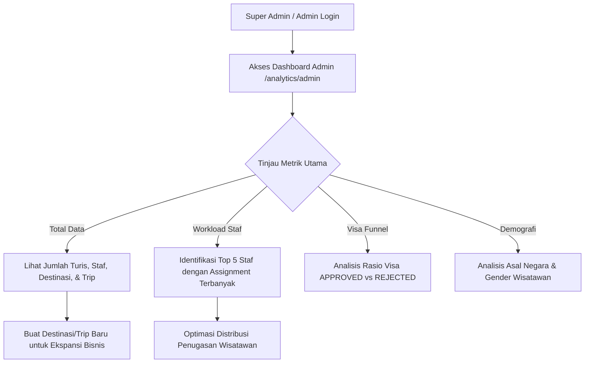
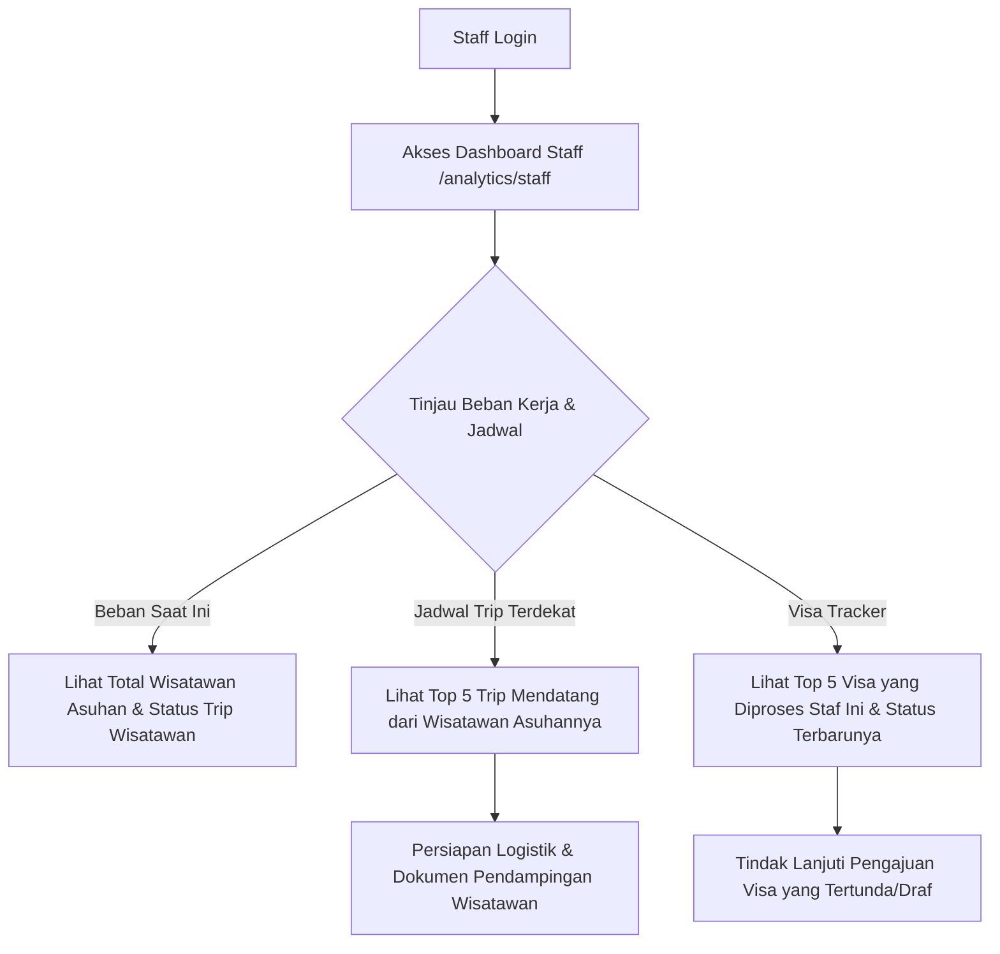
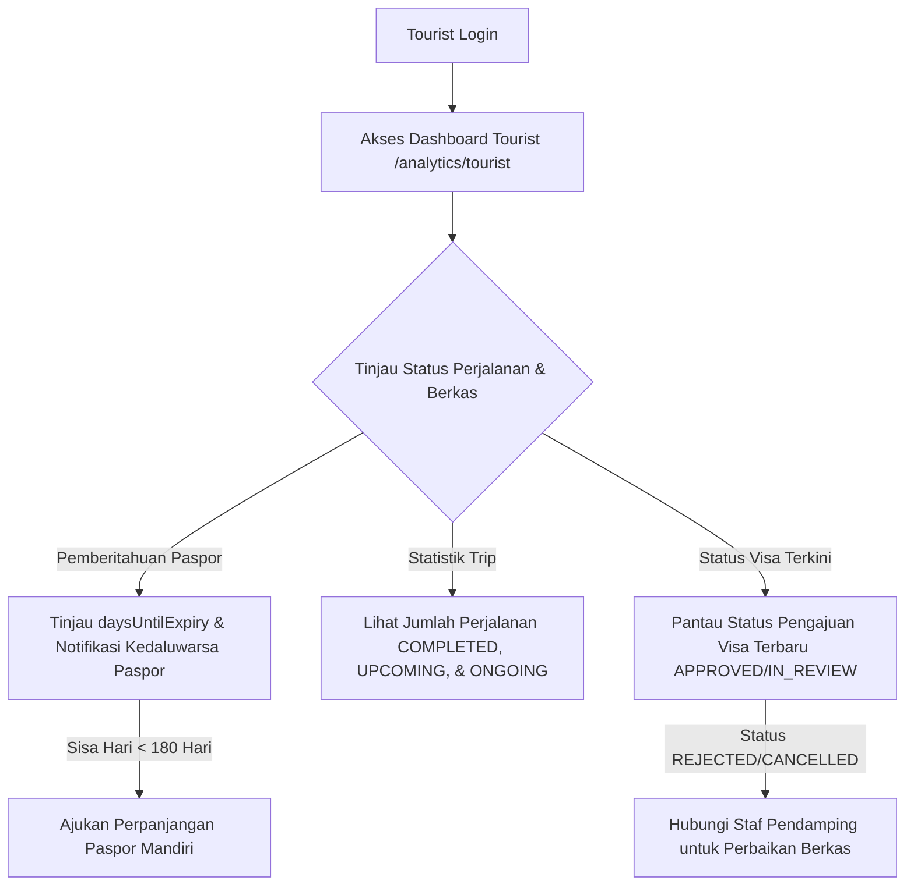

# Tourism Management Backend (Mlaku-Mulu)

[](https://mlaku-mulu-api.onrender.com/)
[](https://mlaku-mulu-api.onrender.com/api/docs)

Backend API untuk **Tourism Management System (Mlaku-Mulu)** yang dirancang menggunakan **NestJS**, **Prisma ORM**, dan **PostgreSQL**. Projek ini siap produksi (*production-ready*) dan ditujukan untuk mempermudah pengelolaan destinasi wisata, penjadwalan perjalanan (*trips*), penugasan staf (*assignments*), manajemen wisatawan (*tourists*), serta pengelolaan berkas paspor dan visa secara aman dan efisien.

*   **URL Aplikasi Live**: [https://mlaku-mulu-api.onrender.com/](https://mlaku-mulu-api.onrender.com/)
*   **Dokumentasi API Swagger**: [https://mlaku-mulu-api.onrender.com/api/docs](https://mlaku-mulu-api.onrender.com/api/docs)

---

## Fitur Utama

*   **Autentikasi Ganda (Employee & Tourist)**: Flow login terpisah antara karyawan (Employee) dan wisatawan (Tourist) menggunakan JWT Access Token (durasi 15 menit).
*   **Refresh Token Rotation (RTR)**: Sistem penyegaran token yang aman dengan menyimpan hash token di database dan merotasinya setiap kali digunakan (durasi 30 hari). Re-use token yang sudah kedaluwarsa/direvok akan otomatis menghapus seluruh session aktif untuk mencegah pencurian token.
*   **Portal Mandiri Wisatawan (Tourist Self-Service)**: Wisatawan dapat melihat profil diri, riwayat perjalanan, dan detail perjalanan yang ditugaskan secara aman (dilengkapi proteksi IDOR).
*   **Sistem Alur Visa (Visa State-Machine)**: Alur pengajuan visa dengan transisi status yang ketat: `DRAFT` &rarr; `SUBMITTED` &rarr; `IN_REVIEW` &rarr; `APPROVED`/`REJECTED`/`CANCELLED`. Nomor pengajuan dihasilkan secara otomatis per tahun (`VA-YYYY-000001`).
*   **Dashboard Analitik Real-Time (Business Intelligence)**: Pusat pemantauan operasional terpisah berdasarkan hak akses pengguna:
    *   **Admin/Super Admin**: Statistik bisnis makro, demografi wisatawan, sebaran visa, dan metrik kinerja/beban staf.
    *   **Staff**: Metrik pendampingan personal, trip asuhan mendatang, dan pemantauan berkas visa yang sedang ditangani.
    *   **Tourist**: Portal notifikasi cerdas untuk sisa masa aktif paspor dan rangkuman riwayat trip.
*   **Soft Delete**: Fitur penghapusan logis (*soft delete*) di entitas utama (`Employee`, `Tourist`, `VisaApplication`, `Destination`, `Trip`) untuk menjaga integritas data dan riwayat audit.
*   **Rate Limiting Global & Spesifik**: Batasan request global (default 100 req/menit) dengan proteksi lebih ketat pada endpoint autentikasi (5 req/menit) menggunakan `@nestjs/throttler`.
*   **Hardening Keamanan**: Header keamanan HTTP bawaan menggunakan Helmet, dynamic CORS berbasis whitelist origin, enkripsi password menggunakan Bcrypt, dan validasi DTO ketat menggunakan `class-validator`.

---

## Tech Stack

*   **Framework**: NestJS (TypeScript)
*   **ORM**: Prisma ORM
*   **Database**: PostgreSQL
*   **Autentikasi**: Passport & JWT (Access Token + Refresh Token Rotation)
*   **Keamanan**: Helmet (HTTP Headers), Bcrypt (Password & Token Hashing), Throttler (Rate Limiting)
*   **Dokumentasi**: Swagger UI
*   **Validasi**: Joi (Env variables), Class Validator & Transformer (Request DTOs)

---

## Arsitektur & Struktur Proyek

Projek ini menerapkan modular pattern bawaan NestJS yang memisahkan boundary domain untuk menjaga skalabilitas dan kemudahan pengujian.

```text
src/
├── common/             # Utilities global (decorators, guards, filters, interceptors, pagination)
├── config/             # Konfigurasi aplikasi (app, jwt, database, swagger, env validation)
├── modules/            # Modul fitur / domain bisnis utama
│   ├── auth/           # Kontrol login, logout, refresh token, & guard autentikasi
│   ├── employee/       # Manajemen staf & peran (Super Admin, Admin, Staff)
│   ├── tourists/       # Manajemen profil wisatawan & portal self-service
│   ├── passports/      # Data paspor wisatawan (relasi 1:1)
│   ├── destinations/   # Pengelolaan destinasi wisata
│   ├── trips/          # Penjadwalan perjalanan wisata
│   ├── assignments/    # Penugasan staf ke wisatawan
│   ├── visa-applications/ # Workflow pengajuan visa wisatawan
│   └── analytics/      # Dashboard analitik real-time untuk Admin, Staff, & Tourist
├── app.module.ts       # Root module pendaftaran seluruh konfigurasi & sub-modul
└── main.ts             # Entry point inisialisasi NestJS server
```

---

## Dokumentasi API (Swagger)

Seluruh dokumentasi API interaktif, skema DTO, serta contoh request/response disajikan secara lengkap di **Swagger UI**. Reviewer dapat menguji langsung setiap endpoint secara langsung melalui sandbox Swagger:

*   **URL Dokumentasi Swagger**: [https://mlaku-mulu-api.onrender.com/api/docs](https://mlaku-mulu-api.onrender.com/api/docs)
*   *Catatan: Pastikan untuk login terlebih dahulu melalui endpoint `/auth/login` untuk mendapatkan Access Token, lalu masukkan token tersebut pada tombol **Authorize** di Swagger.*

### Ringkasan Endpoint Per Modul

*   **Auth Module** (`/auth/*`): Login ganda (staf & wisatawan), logout aman (revok token), dan rotasi token (`/refresh`).
*   **Employee Module** (`/employees/*`): Manajemen staf (CRUD) khusus untuk peran Super Admin & Admin.
*   **Tourists Module** (`/tourists/*`):
    *   Kelola wisatawan (CRUD oleh staf).
    *   Akses mandiri wisatawan (`/tourists/me`, `/tourists/me/trips`, `/tourists/me/trips/:tripId`).
*   **Passports Module** (`/passports/*`): Data paspor pendukung profil wisatawan.
*   **Destinations Module** (`/destinations/*`): Pengelolaan destinasi wisata tujuan.
*   **Trips Module** (`/trips/*`): Penjadwalan perjalanan dan penugasan wisatawan ke grup trip.
*   **Assignments Module** (`/assignments/*`): Penugasan pendampingan wisatawan oleh staf.
*   **Visa Applications Module** (`/api/v1/visa-applications/*`): Pengajuan dan persetujuan visa wisatawan.
*   **Analytics Module** (`/analytics/*`): Endpoint analitik operasional terpusat dengan otorisasi berbasis role (`admin`, `staff`, dan `tourist`).

---

## Alur Pengguna (User Flows)

Berikut adalah analisis dan visualisasi alur operasional untuk tiga persona pengguna utama pada sistem Mlaku-Mulu:

### 1. Alur Pengguna: Admin & Super Admin (Operasional Bisnis Makro)
Peran Admin/Super Admin berfokus pada pengawasan kinerja bisnis makro, alokasi sumber daya staf, dan manajemen destinasi global.


### 2. Alur Pengguna: Staff (Manajemen Wisatawan & Dokumen)
Peran Staff berfokus pada pendampingan personal wisatawan, koordinasi trip, dan pemrosesan berkas paspor/visa secara efisien.


### 3. Alur Pengguna: Tourist (Portal Mandiri Wisatawan)
Peran Tourist berfokus pada pemantauan berkas perjalanan mandiri tanpa memerlukan interaksi tatap muka langsung dengan staf.


---

## Environment Variables

Berikut adalah variabel lingkungan yang divalidasi secara ketat menggunakan schema Joi sebelum server dijalankan:

| Nama Variabel | Wajib | Keterangan |
| :--- | :---: | :--- |
| `PORT` | Ya | Port jalannya server (misal: `3000`) |
| `DATABASE_URL` | Ya | URI koneksi database PostgreSQL (`postgresql://...`) |
| `JWT_ACCESS_SECRET` | Ya | Key rahasia untuk enkripsi JWT Access Token |
| `JWT_ACCESS_EXPIRES_IN` | Ya | Durasi kedaluwarsa Access Token (misal: `15m`) |
| `JWT_REFRESH_SECRET` | Ya | Key rahasia untuk enkripsi JWT Refresh Token |
| `JWT_REFRESH_EXPIRES_IN` | Ya | Durasi kedaluwarsa Refresh Token (misal: `30d`) |
| `CORS_ORIGIN` | Tidak | Daftar asal URL frontend yang diizinkan (dipisah koma) |
| `ENABLE_SWAGGER` | Tidak | Set ke `true` untuk mengaktifkan Swagger UI |

---

## Cara Menjalankan Secara Lokal

### 1. Inisialisasi Environment
Buat berkas `.env` di root direktori dengan menyalin format dari variabel lingkungan di atas.

### 2. Instal Dependencies
```bash
npm install
```

### 3. Setup Database & Migrasi
Pastikan PostgreSQL Anda sudah berjalan, lalu jalankan perintah Prisma berikut untuk sinkronisasi schema:
```bash
npx prisma migrate deploy
```

### 4. Seed Data (Opsional)
Jalankan seeder untuk membuat akun Super Admin bawaan pertama kali:
```bash
npx prisma db seed
```
*   **Super Admin Bawaan**: `superadmin@example.com` | **Password**: `superadmin123`

### 5. Jalankan Server
```bash
# Mode development
npm run start

# Mode watch (auto-reload saat file disimpan)
npm run start:dev

# Mode production hasil build
npm run start:prod
```

---

## Deployment ke Render

Projek ini dikonfigurasi untuk siap dideploy ke **Render** dengan database eksternal (PostgreSQL hosted):

*   **Build Command**:
    ```bash
    npm install && npx prisma generate && npm run build && npx prisma migrate deploy
    ```
*   **Start Command**:
    ```bash
    node dist/src/main
    ```
    *(Catatan: Entry point startup disesuaikan ke `dist/src/main` karena kompilasi menyertakan konfigurasi root level).*
*   **Database Seeding di Render**:
    Setelah status layanan online/live, buka tab **Shell** di Render dashboard dan jalankan seeder sekali:
    ```bash
    npx prisma db seed
    ```

---

## Fitur Keamanan

*   **Bcrypt Hashing**: Password pengguna dan database token-hash diamankan menggunakan hash satu arah berulang kali.
*   **RTR (Refresh Token Rotation)**: Setiap refresh menghasilkan pasangan token baru dan membatalkan token lama. Re-play attack akan memicu pembatalan seluruh session untuk mencegah hijacking.
*   **Proteksi IDOR**: Endpoint Tourist Portal (`/tourists/me/*`) secara dinamis memetakan data berdasarkan klaim JWT id subjek login, bukan dari query parameter client.
*   **Rate Limiting Ketat**: Jalur kritis autentikasi dilindungi dari serangan *brute force* menggunakan batasan ketat.
*   **Helmet & CORS**: Menghalangi ancaman XSS, clickjacking, dan pembajakan domain silang di tingkat protokol HTTP.

---

## Keputusan Arsitektur (Architectural Decisions)

*   **Modular Architecture**: Mengelompokkan kode berdasarkan domain fitur (misal: `Auth`, `Tourist`, `Trips`) guna memastikan kode mandiri, minim konflik dependensi, dan mudah dimaintain.
*   **Prisma ORM**: Menyediakan type-safety penuh dari skema database langsung ke kode TypeScript, mempercepat manipulasi data dan meminimalisir kesalahan query SQL.
*   **Soft Deletes**: Menggunakan kolom `deletedAt` untuk menyembunyikan data yang dihapus dari hadapan publik tanpa merusak riwayat relasional atau menghapus entitas secara permanen demi kebutuhan audit.
*   **Filter Pengecualian Global**: Menangkap kesalahan database Prisma secara tersentralisasi untuk menghasilkan format pesan error seragam (API error standard), menyembunyikan detail mentah stack trace internal dari publik demi keamanan.
